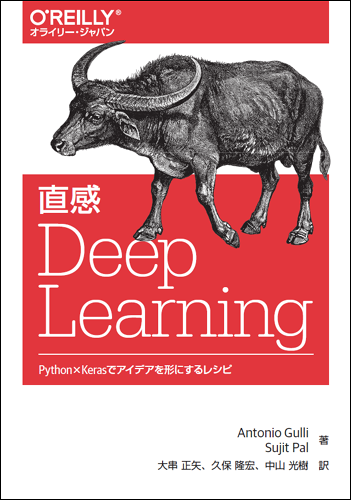

# 直感 Deep Learning

---



---

本リポジトリはオライリー・ジャパン発行書籍『[直感 Deep Learning](http://www.oreilly.co.jp/books/9784873118260/)』（原書名『[Deep Learning with Keras](https://www.packtpub.com/big-data-and-business-intelligence/deep-learning-keras)』）のサポートサイトです。

## サンプルコード

### ファイル構成

|フォルダ名 |説明                         |
|:--        |:--                          |
|ch01       |1章で使用するソースコードとライブラリ導入に必要なrequirements.txt    |
|ch02       |2章で使用するソースコードとライブラリ導入に必要なrequirements.txt     |
|...        |...                          |
|ch08       |8章で使用するソースコードとライブラリ導入に必要なrequirements.txt     |

サンプルコードの解説は本書籍をご覧ください。

## 仮想環境の準備

環境構築の方法は読者に任せていますが、一般的には仮想環境を構築する方法を推奨されるのでその方法を記述しておきます。

`pyenv`と`virtualenv`の導入をします。

linux
```
apt-get install pyenv
apt-get install virtualenv
```
Mac
```
brew install pyenv
brew install virtualenv
```

`pyenv`と`virtualenv`を用いて仮想環境を構築します。

```
pyenv install 3.6.0
pyenv rehash
pyenv local 3.6.0
virtualenv -p ~/.pyenv/versions/3.6.0/bin/python3.6 my_env
source my_env/bin/activate

```

Windows

[Anaconda](https://www.anaconda.com/download/#windows)を導入して下さい


### 使用方法

サンプルを実行する前に、必要なライブラリをインストールする必要があります。

```bash
$ pip install -r requirements.txt
```

CPU用の`requirements.txt`とGPU用の`requirements_gpu.txt`を章ごとに用意してあります。

> 巻末の付録Aで、GPUを考慮した開発環境の構築について補足していますので参考にしてください。

各章のフォルダへ移動して、Pythonコマンドを実行します。書籍にどのpythonコードを動作させているか明記しています。
下記は一例です。

```
cd ch03
python cifar10_deep_with_aug.py
```

## 実行環境

日本語版で検証に使用した各ソフトウェアのバージョン、およびハードウェアは次のとおりです。

#### ソフトウェア

* Pycharm-community-2017.1
* Python 3.6.0（10章ではDocker環境での簡易的な確認のため3.5.2）
* TensorFlow 1.8.0
* Keras 2.1.6（4章では他のライブラリとの関係があるため2.1.2）
* h5py 2.7.1
* numpy 1.14.0
* scipy 1.0.0
* quiver-engine 0.1.4.1.4
* matplotlib 2.1.1
* picklable\_itertools 0.1.1以上
* sacred 0.6.10以上
* tqdm 4.8.4以上
* q 2.6以上
* gensim 3.2.0
* nltk 3.2.5
* scikit-learn 0.19.1
* pandas 0.22.0
* Pillow 4.3.0
* gym 0.10.5
* pygame 1.9.3
* html5lib 0.9999999
* keras-adversarial 0.0.3
* PyYAML 3.12
* requests 2.14.2

##### GPUを使用する場合

* tensorflow-gpu 1.8.0
* cuda 9.0
* cuDNN 7.0.5

##### Macで使用する場合の注意点

`matplotlib`を標準設定のまま使用すると下記のようなエラーが発生します。これはMacで設定されている標準の画像レンダリングAPIが`matplotlib`で使用するものと異なるためです。

```
RuntimeError: Python is not installed as a framework. The Mac OS X backend will not be able to function correctly if Python is not installed as a framework. See the Python documentation for more information on installing Python as a framework on Mac OS X. Please either reinstall Python as a framework, or try one of the other backends. If you are using (Ana)Conda please install python.app and replace the use of 'python' with 'pythonw'. See 'Working with Matplotlib on OSX' in the Matplotlib FAQ for more information.
```

`matplotlib`を使用する前に下記のように画像レンダリングAPIを設定して使用してください。

```py
import matplotlib as mpl
mpl.use('TkAgg')
```

#### 動作確認済みハードウェア

 * Ubuntu 16.04 LTS（GPU：GeForce GTX 1080）
 * 64ビットアーキテクチャ
 * Intel(R) Core(TM) i7-6700 CPU @ 3.40GHz
 * 16GBのRAM
 * ハードディスクの空き容量は少なくとも10GB

## 正誤表

下記の誤りがありました。お詫びして訂正いたします。

本ページに掲載されていない誤植など間違いを見つけた方は、japan@oreilly.co.jpまでお知らせください。

### 第1刷

#### ■1章 P.22 1行目

**誤**
```
from keras.layersimport Dense, Dropout, Activation
```
**正**
```
from keras.layers import Dense, Dropout, Activation
```
